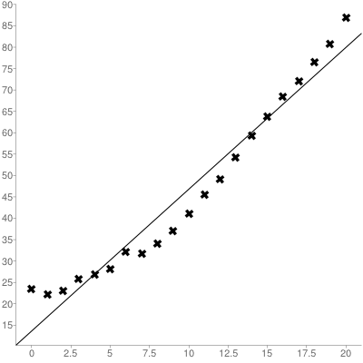
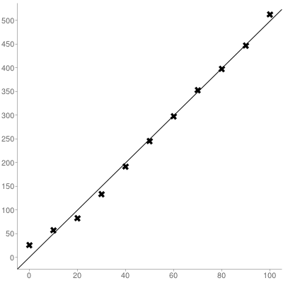
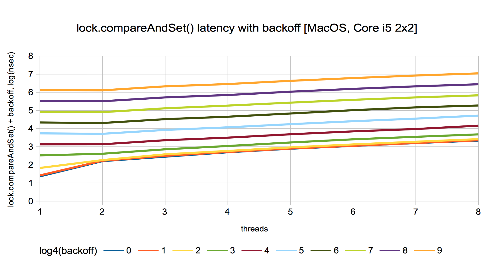

SimpleSpinLock
=======

Problem statement
-----

Given the following microbenchmark:
```java
@State(Scope.Benchmark)
public class SimpleSpinLock {

    final int NUM_THREADS = 2;
    final int LOCK_INSIDE_BACKOFF = 3;
    final int LOCK_OUTSIDE_BACKOFF = 4;

    AtomicInteger lock = new AtomicInteger(0);

    @Benchmark
    @BenchmarkMode(Mode.AverageTime)
    @OutputTimeUnit(TimeUnit.NANOSECONDS)
    @Threads(NUM_THREADS)
    public void measureSpinLockToggleUnderContention() {
        while (!lock.compareAndSet(0, 1));
        Blackhole.consumeCPU(LOCK_INSIDE_BACKOFF);
        lock.set(0);
        Blackhole.consumeCPU(LOCK_OUTSIDE_BACKOFF);
    }

}
```

That's my first benchmark to analyze. Firstly, I gather sample time measurements
 for the trivial case: with only one thread being run. There still should be CAS
 instruction being emitted and run on HW, so I expect to measure the cost of some cache flush on my HW. Then
 I show data for multi-threading case.


Sample time measurements for the single thread
---

By default I do all the experiments on my Mac (Intel Core i5-4258U Haswell, Mac OS X 10.10 Yosemite, JRE 1.8.0_05-b13).

Let's run the benchmark on my Mac with the simplest constants:

```java
final int NUM_THREADS = 1;
final int LOCK_INSIDE_BACKOFF = 1;
final int LOCK_OUTSIDE_BACKOFF = 1;
```

I run it with the following command-line arguments:
```
mvn clean install
java -jar target/benchmarks.jar -wi 10 -i 10 -f 3
```

I get the following output:
```
# VM invoker: /Library/Java/JavaVirtualMachines/jdk1.8.0_05.jdk/Contents/Home/jre/bin/java
# VM options: <none>
# Warmup: 10 iterations, 1 s each
# Measurement: 10 iterations, 1 s each
# Timeout: 10 min per iteration
# Threads: 1 thread, will synchronize iterations
# Benchmark mode: Average time, time/op
# Benchmark: org.sample.SimpleSpinLock.measureSpinLockToggleUnderContention

# Run progress: 0,00% complete, ETA 00:01:00
# Fork: 1 of 3
# Warmup Iteration   1: 26,340 ns/op
# Warmup Iteration   2: 28,441 ns/op
# Warmup Iteration   3: 25,553 ns/op
# Warmup Iteration   4: 25,189 ns/op
# Warmup Iteration   5: 25,389 ns/op
# Warmup Iteration   6: 25,217 ns/op
# Warmup Iteration   7: 25,020 ns/op
# Warmup Iteration   8: 25,277 ns/op
# Warmup Iteration   9: 25,145 ns/op
# Warmup Iteration  10: 25,614 ns/op
Iteration   1: 22,968 ns/op
Iteration   2: 23,354 ns/op
Iteration   3: 23,825 ns/op
Iteration   4: 22,100 ns/op
Iteration   5: 21,276 ns/op
Iteration   6: 21,396 ns/op
Iteration   7: 21,384 ns/op
Iteration   8: 21,032 ns/op
Iteration   9: 20,578 ns/op
Iteration  10: 20,987 ns/op

# Run progress: 33,33% complete, ETA 00:00:41
# Fork: 2 of 3
# Warmup Iteration   1: 23,719 ns/op
# Warmup Iteration   2: 25,079 ns/op
# Warmup Iteration   3: 20,694 ns/op
# Warmup Iteration   4: 20,873 ns/op
# Warmup Iteration   5: 20,454 ns/op
# Warmup Iteration   6: 20,639 ns/op
# Warmup Iteration   7: 20,584 ns/op
# Warmup Iteration   8: 21,176 ns/op
# Warmup Iteration   9: 20,755 ns/op
# Warmup Iteration  10: 21,128 ns/op
Iteration   1: 20,934 ns/op
Iteration   2: 20,342 ns/op
Iteration   3: 20,157 ns/op
Iteration   4: 20,364 ns/op
Iteration   5: 20,437 ns/op
Iteration   6: 20,574 ns/op
Iteration   7: 20,222 ns/op
Iteration   8: 20,068 ns/op
Iteration   9: 20,332 ns/op
Iteration  10: 20,408 ns/op

# Run progress: 66,67% complete, ETA 00:00:20
# Fork: 3 of 3
# Warmup Iteration   1: 23,970 ns/op
# Warmup Iteration   2: 24,197 ns/op
# Warmup Iteration   3: 20,417 ns/op
# Warmup Iteration   4: 20,123 ns/op
# Warmup Iteration   5: 20,309 ns/op
# Warmup Iteration   6: 20,404 ns/op
# Warmup Iteration   7: 20,234 ns/op
# Warmup Iteration   8: 20,233 ns/op
# Warmup Iteration   9: 20,458 ns/op
# Warmup Iteration  10: 20,453 ns/op
Iteration   1: 20,297 ns/op
Iteration   2: 19,979 ns/op
Iteration   3: 20,451 ns/op
Iteration   4: 20,533 ns/op
Iteration   5: 20,414 ns/op
Iteration   6: 20,321 ns/op
Iteration   7: 20,532 ns/op
Iteration   8: 20,889 ns/op
Iteration   9: 20,581 ns/op
Iteration  10: 20,504 ns/op


Result: 20,908 ±(99.9%) 0,642 ns/op [Average]
  Statistics: (min, avg, max) = (19,979, 20,908, 23,825), stdev = 0,960
  Confidence interval (99.9%): [20,266, 21,550]


# Run complete. Total time: 00:01:01

Benchmark                                                  Mode  Samples   Score   Error  Units
o.s.SimpleSpinLock.measureSpinLockToggleUnderContention    avgt       30  20,908 ± 0,642  ns/op
```

Ok, looks like the most interesting part is the final score, if only I see that in all forks
I've reached "steady state" while doing warmup iterations. That's not the case for the fork 1 from above,
but it seems to be true for the forks 2 and 3. So let's re-run it with `-wi 20`:

```
Benchmark                                                  Mode  Samples   Score   Error  Units
o.s.SimpleSpinLock.measureSpinLockToggleUnderContention    avgt       30  21,078 ± 0,259  ns/op
```

So, 21 ns is the time of cache synchronization on my Haswell.

Then I tried to run it on my Linux VPS on DigitalOcean (with `-wi 10`) and was very disappointed, because error was
large:
```
Result: 557.724 ±(99.9%) 112.817 ns/op [Average]
  Statistics: (min, avg, max) = (367.401, 557.724, 986.130), stdev = 168.859
  Confidence interval (99.9%): [444.907, 670.541]


# Run complete. Total time: 00:06:23

Benchmark                                                  Mode  Samples    Score     Error  Units
o.s.SimpleSpinLock.measureSpinLockToggleUnderContention    avgt       30  557.724 ± 112.817  ns/op
```

So it doesn't seem to be reasonable to run the perf tests on VPS.

Perfasm: check that there's no reordering
--------

Firstly, I tried to grab perfasm data from Ubuntu 14.04 Trusty being run via VirtualBox, but I failed:
```
$ java -jar target/benchmarks.jar -wi 5 -i 5 -f 1 -prof perfasm
# VM invoker: /usr/lib/jvm/java-8-oracle/jre/bin/java
# VM options: <none>
# Warmup: 5 iterations, 1 s each
# Measurement: 5 iterations, 1 s each
# Timeout: 10 min per iteration
# Threads: 100 threads, will synchronize iterations
# Benchmark mode: Average time, time/op
# Benchmark: org.sample.SimpleSpinLock.measureSpinLockToggleUnderContention

# Run progress: 0.00% complete, ETA 00:00:10
# Fork: 1 of 1
# Preparing profilers: perfasm 
# Profilers consume stdout and stderr from target VM, use -v EXTRA to copy to console
<forked VM failed with exit code 255>
<stdout last='20 lines'>
</stdout>
<stderr last='20 lines'>
Error:
The instructions event is not supported.
/usr/lib/jvm/java-8-oracle/jre/bin/java: Terminated
</stderr>

# Run complete. Total time: 00:00:00

Benchmark    Mode  Samples  Score   Error  Units
```

It doesn't work because JMH wants to listen for "instructions" event, and perf under VM doesn't provide
 them:
```
$ perf list

List of pre-defined events (to be used in -e):
  cpu-clock                                          [Software event]
  task-clock                                         [Software event]
  page-faults OR faults                              [Software event]
  context-switches OR cs                             [Software event]
  cpu-migrations OR migrations                       [Software event]
  minor-faults                                       [Software event]
  major-faults                                       [Software event]
  alignment-faults                                   [Software event]
  emulation-faults                                   [Software event]
  dummy                                              [Software event]

  rNNN                                               [Raw hardware event descriptor]
  cpu/t1=v1[,t2=v2,t3 ...]/modifier                  [Raw hardware event descriptor]
   (see 'man perf-list' on how to encode it)

  mem:<addr>[:access]                                [Hardware breakpoint]

  [ Tracepoints not available: Permission denied ]
```

So I ran perfasm on real Linux instead. If you try to do that, your first problem (missing hsdis-amd64.so library)
is cured by
[this post](http://psy-lob-saw.blogspot.ru/2013/01/java-print-assembly.html). Here we go:
```
Hottest code regions (>10.00% "cycles" events):
....[Hottest Region 1]..............................................................................
 [0x7f8c111b2270:0x7f8c111b22e1] in org.sample.generated.SimpleSpinLock_measureSpinLockToggleUnderContention::measureSpinLockToggleUnderContention_avgt_jmhStub

                    0x00007f8c111b2254: mov    (%rsp),%r8
                    0x00007f8c111b2258: movzbl 0x94(%r8),%r11d    ;*getfield isDone
                                                                  ; - org.sample.generated.SimpleSpinLock_measureSpinLockToggleUnderContention::measureSpinLockToggleUnderContention_avgt_jmhStub@24 (line 164)
                                                                  ; implicit exception: dispatches to 0x00007f8c111b23c1
                    0x00007f8c111b2260: mov    $0x1,%ebp
                    0x00007f8c111b2265: test   %r11d,%r11d
                    0x00007f8c111b2268: jne    0x00007f8c111b22ec  ;*ifeq
                                                                  ; - org.sample.generated.SimpleSpinLock_measureSpinLockToggleUnderContention::measureSpinLockToggleUnderContention_avgt_jmhStub@27 (line 164)
                    0x00007f8c111b226e: xchg   %ax,%ax            ;*aload_3
                                                                  ; - org.sample.generated.SimpleSpinLock_measureSpinLockToggleUnderContention::measureSpinLockToggleUnderContention_avgt_jmhStub@13 (line 162)
  0.48%             0x00007f8c111b2270: mov    0x10(%rsp),%r11
                    0x00007f8c111b2275: mov    0x14(%r11),%r10d   ;*getfield lock
                                                                  ; - org.sample.SimpleSpinLock::measureSpinLockToggleUnderContention@1 (line 68)
                                                                  ; - org.sample.generated.SimpleSpinLock_measureSpinLockToggleUnderContention::measureSpinLockToggleUnderContention_avgt_jmhStub@14 (line 162)
                    0x00007f8c111b2279: test   %r10d,%r10d
                    0x00007f8c111b227c: je     0x00007f8c111b2316
                    0x00007f8c111b2282: xor    %eax,%eax
  0.46%             0x00007f8c111b2284: mov    $0x1,%ecx
                    0x00007f8c111b2289: lock cmpxchg %ecx,0xc(%r10)
 12.36%   18.33%    0x00007f8c111b228f: sete   %r10b
                    0x00007f8c111b2293: movzbl %r10b,%r10d        ;*invokevirtual compareAndSwapInt
                                                                  ; - java.util.concurrent.atomic.AtomicInteger::compareAndSet@9 (line 133)
                                                                  ; - org.sample.SimpleSpinLock::measureSpinLockToggleUnderContention@6 (line 68)
                                                                  ; - org.sample.generated.SimpleSpinLock_measureSpinLockToggleUnderContention::measureSpinLockToggleUnderContention_avgt_jmhStub@14 (line 162)
                    0x00007f8c111b2297: test   %r10d,%r10d
                    0x00007f8c111b229a: je     0x00007f8c111b2335  ;*ifne
                                                                  ; - org.sample.SimpleSpinLock::measureSpinLockToggleUnderContention@9 (line 68)
                                                                  ; - org.sample.generated.SimpleSpinLock_measureSpinLockToggleUnderContention::measureSpinLockToggleUnderContention_avgt_jmhStub@14 (line 162)
  0.61%             0x00007f8c111b22a0: mov    %r8,0x18(%rsp)
                    0x00007f8c111b22a5: movslq 0x10(%r11),%rsi    ;*i2l  ; - org.sample.SimpleSpinLock::measureSpinLockToggleUnderContention@19 (line 69)
                                                                  ; - org.sample.generated.SimpleSpinLock_measureSpinLockToggleUnderContention::measureSpinLockToggleUnderContention_avgt_jmhStub@14 (line 162)
                    0x00007f8c111b22a9: xchg   %ax,%ax
                    0x00007f8c111b22ab: callq  0x00007f8c11046160  ; OopMap{[8]=Oop [16]=Oop [24]=Oop off=272}
                                                                  ;*invokestatic consumeCPU
                                                                  ; - org.sample.SimpleSpinLock::measureSpinLockToggleUnderContention@20 (line 69)
                                                                  ; - org.sample.generated.SimpleSpinLock_measureSpinLockToggleUnderContention::measureSpinLockToggleUnderContention_avgt_jmhStub@14 (line 162)
                                                                  ;   {static_call}
  0.56%             0x00007f8c111b22b0: mov    0x10(%rsp),%r10
  0.03%             0x00007f8c111b22b5: mov    0x14(%r10),%r11d   ;*getfield lock
                                                                  ; - org.sample.SimpleSpinLock::measureSpinLockToggleUnderContention@24 (line 70)
                                                                  ; - org.sample.generated.SimpleSpinLock_measureSpinLockToggleUnderContention::measureSpinLockToggleUnderContention_avgt_jmhStub@14 (line 162)
                    0x00007f8c111b22b9: test   %r11d,%r11d
                    0x00007f8c111b22bc: je     0x00007f8c111b2325
  0.61%             0x00007f8c111b22be: mov    %r12d,0xc(%r11)
                    0x00007f8c111b22c2: lock addl $0x0,(%rsp)     ;*putfield value
                                                                  ; - java.util.concurrent.atomic.AtomicInteger::set@2 (line 100)
                                                                  ; - org.sample.SimpleSpinLock::measureSpinLockToggleUnderContention@28 (line 70)
                                                                  ; - org.sample.generated.SimpleSpinLock_measureSpinLockToggleUnderContention::measureSpinLockToggleUnderContention_avgt_jmhStub@14 (line 162)
 11.93%   17.79%    0x00007f8c111b22c7: movslq 0x10(%r10),%rsi
  0.03%             0x00007f8c111b22cb: callq  0x00007f8c11046160  ; OopMap{[8]=Oop [16]=Oop [24]=Oop off=304}
                                                                  ;*invokestatic consumeCPU
                                                                  ; - org.sample.SimpleSpinLock::measureSpinLockToggleUnderContention@36 (line 71)
                                                                  ; - org.sample.generated.SimpleSpinLock_measureSpinLockToggleUnderContention::measureSpinLockToggleUnderContention_avgt_jmhStub@14 (line 162)
                                                                  ;   {static_call}
  0.53%             0x00007f8c111b22d0: mov    0x18(%rsp),%r8
                    0x00007f8c111b22d5: movzbl 0x94(%r8),%r10d    ;*getfield isDone
                                                                  ; - org.sample.generated.SimpleSpinLock_measureSpinLockToggleUnderContention::measureSpinLockToggleUnderContention_avgt_jmhStub@24 (line 164)
                    0x00007f8c111b22dd: add    $0x1,%rbp          ; OopMap{r8=Oop [8]=Oop [16]=Oop off=321}
                                                                  ;*ifeq
                                                                  ; - org.sample.generated.SimpleSpinLock_measureSpinLockToggleUnderContention::measureSpinLockToggleUnderContention_avgt_jmhStub@27 (line 164)
  0.43%             0x00007f8c111b22e1: test   %eax,0x1762ad19(%rip)        # 0x00007f8c287dd000
                                                                  ;   {poll}
                    0x00007f8c111b22e7: test   %r10d,%r10d
                    0x00007f8c111b22ea: je     0x00007f8c111b2270  ;*aload_2
                                                                  ; - org.sample.generated.SimpleSpinLock_measureSpinLockToggleUnderContention::measureSpinLockToggleUnderContention_avgt_jmhStub@30 (line 165)
                    0x00007f8c111b22ec: mov    $0x7f8c27308080,%r10
                    0x00007f8c111b22f6: callq  *%r10              ;*invokestatic nanoTime
                                                                  ; - org.sample.generated.SimpleSpinLock_measureSpinLockToggleUnderContention::measureSpinLockToggleUnderContention_avgt_jmhStub@31 (line 165)
                    0x00007f8c111b22f9: mov    0x8(%rsp),%r10
....................................................................................................
 28.02%   36.12%  <total for region 1>
```

Good news: our four steps are not reordered by jdk-8:
```
...
                    0x00007f8c111b2293: movzbl %r10b,%r10d        ;*invokevirtual compareAndSwapInt
...
                                                                  ;*invokestatic consumeCPU
...
  0.03%             0x00007f8c111b22b5: mov    0x14(%r10),%r11d   ;*getfield lock
...
                    0x00007f8c111b22c2: lock addl $0x0,(%rsp)     ;*putfield value
...
                                                                  ;*invokestatic consumeCPU
...
```

Don't be confused that we see listing for some strange method:
`measureSpinLockToggleUnderContention_avgt_jmhStub()` comes from generated sources (see the directory
`target/generated-sources/`), and our method `measureSpinLockToggleUnderContention()` is inlined there.

The model for the single thread
---

Being run on a single thread this benchmark should work as follows:

1. `lock.compareAndSet(0, 1)` sets the variable.

 According to AtomicInteger implementation in jdk8, it calls native method `unsafe.compareAndSwapInt()`. Furthermore,
according to the jdk8 source, namely 
http://hg.openjdk.java.net/jdk8/jdk8/hotspot/file/87ee5ee27509/src/share/vm/prims/unsafe.cpp#l1185
http://hg.openjdk.java.net/jdk8/jdk8/hotspot/file/87ee5ee27509/src/share/vm/runtime/atomic.cpp#l67
http://hg.openjdk.java.net/jdk8/jdk8/hotspot/file/87ee5ee27509/src/os_cpu/linux_x86/vm/atomic_linux_x86.inline.hpp#l93
on Linux x86 `compareAndSwapInt()` is expressed by `lock cmpxchgl` (as we can also see on assembler listing).
Lock prefix means exclusive access to memory. I think that even in a single mode this operation does real
synchronization work for core caches and takes some fixed execution time.

2. `Blackhole.consumeCPU()` consumes some time proportional to number of tokens passed.

3. `lock.set(0);` unconditionally sets the value, so it's just a `mov` which should result in assignment inside register
file. This should take about 0.5ns, so we probably won't see statistically significant time required by this operation.

4. Yet another `Blackhole.consumeCPU()`.  Let's have the same number of tokens passed in both `consumeCPU()` calls.

So having NUM_TOKENS as a variable, we can suggest the linear model for execution time:
```
EXECUTION_TIME = CONSUME_TIME * NUM_TOKENS + CAS_TIME
```

To prove this hypothesis, we need to gather 10-20 points.

```java
@BenchmarkMode(Mode.AverageTime)
@OutputTimeUnit(TimeUnit.NANOSECONDS)
@Warmup(iterations = 10, time = 100, timeUnit = TimeUnit.MILLISECONDS)
@Measurement(iterations = 10, time = 100, timeUnit = TimeUnit.MILLISECONDS)
@Fork(5)
@State(Scope.Benchmark)
public class SimpleSpinLock {

    final int NUM_THREADS = 1;

    @Param({"0", "1", "2", "3", "4", "5", "6", "7", "8", "9", "10", "11", "12", "13", "14", "15", "16", "17", "18",
            "19", "20"})
    public int num_tokens;

    AtomicInteger lock = new AtomicInteger(0);

    @Benchmark
    @Threads(NUM_THREADS)
    public void measureSpinLockToggleUnderContention() {
        while (!lock.compareAndSet(0, 1));
        Blackhole.consumeCPU(num_tokens);
        lock.set(0);
        Blackhole.consumeCPU(num_tokens);
    }

}
```

```
Benchmark                                                  (num_tokens)  Mode  Samples   Score   Error  Units
o.s.SimpleSpinLock.measureSpinLockToggleUnderContention               0  avgt       50  23,542 ± 0,376  ns/op
o.s.SimpleSpinLock.measureSpinLockToggleUnderContention               1  avgt       50  22,132 ± 0,434  ns/op
o.s.SimpleSpinLock.measureSpinLockToggleUnderContention               2  avgt       50  23,122 ± 0,422  ns/op
o.s.SimpleSpinLock.measureSpinLockToggleUnderContention               3  avgt       50  25,730 ± 0,901  ns/op
o.s.SimpleSpinLock.measureSpinLockToggleUnderContention               4  avgt       50  26,876 ± 0,918  ns/op
o.s.SimpleSpinLock.measureSpinLockToggleUnderContention               5  avgt       50  28,067 ± 0,444  ns/op
o.s.SimpleSpinLock.measureSpinLockToggleUnderContention               6  avgt       50  32,185 ± 2,617  ns/op
o.s.SimpleSpinLock.measureSpinLockToggleUnderContention               7  avgt       50  31,774 ± 0,508  ns/op
o.s.SimpleSpinLock.measureSpinLockToggleUnderContention               8  avgt       50  34,143 ± 1,337  ns/op
o.s.SimpleSpinLock.measureSpinLockToggleUnderContention               9  avgt       50  37,133 ± 0,581  ns/op
o.s.SimpleSpinLock.measureSpinLockToggleUnderContention              10  avgt       50  41,024 ± 0,689  ns/op
o.s.SimpleSpinLock.measureSpinLockToggleUnderContention              11  avgt       50  45,470 ± 0,980  ns/op
o.s.SimpleSpinLock.measureSpinLockToggleUnderContention              12  avgt       50  49,104 ± 0,847  ns/op
o.s.SimpleSpinLock.measureSpinLockToggleUnderContention              13  avgt       50  54,263 ± 0,824  ns/op
o.s.SimpleSpinLock.measureSpinLockToggleUnderContention              14  avgt       50  59,305 ± 0,787  ns/op
o.s.SimpleSpinLock.measureSpinLockToggleUnderContention              15  avgt       50  63,805 ± 0,804  ns/op
o.s.SimpleSpinLock.measureSpinLockToggleUnderContention              16  avgt       50  68,509 ± 1,058  ns/op
o.s.SimpleSpinLock.measureSpinLockToggleUnderContention              17  avgt       50  71,964 ± 1,058  ns/op
o.s.SimpleSpinLock.measureSpinLockToggleUnderContention              18  avgt       50  76,533 ± 1,232  ns/op
o.s.SimpleSpinLock.measureSpinLockToggleUnderContention              19  avgt       50  80,660 ± 1,011  ns/op
o.s.SimpleSpinLock.measureSpinLockToggleUnderContention              20  avgt       50  86,846 ± 1,577  ns/op
```

Let's omit the error (I don't know how to take it into account properly) and just fit this data with linear model:


It doesn't seem to be quite linear, to be honest. Let's pick some more data with greater step for num_tokens:

```
Benchmark                                                  (num_tokens)  Mode  Samples    Score    Error  Units
o.s.SimpleSpinLock.measureSpinLockToggleUnderContention               0  avgt       50   25,100 ±  1,701  ns/op
o.s.SimpleSpinLock.measureSpinLockToggleUnderContention              10  avgt       50   56,906 ± 38,272  ns/op
o.s.SimpleSpinLock.measureSpinLockToggleUnderContention              20  avgt       50   82,890 ±  1,273  ns/op
o.s.SimpleSpinLock.measureSpinLockToggleUnderContention              30  avgt       50  132,726 ±  2,015  ns/op
o.s.SimpleSpinLock.measureSpinLockToggleUnderContention              40  avgt       50  191,025 ±  2,757  ns/op
o.s.SimpleSpinLock.measureSpinLockToggleUnderContention              50  avgt       50  244,834 ±  3,432  ns/op
o.s.SimpleSpinLock.measureSpinLockToggleUnderContention              60  avgt       50  297,461 ±  3,806  ns/op
o.s.SimpleSpinLock.measureSpinLockToggleUnderContention              70  avgt       50  352,860 ±  6,721  ns/op
o.s.SimpleSpinLock.measureSpinLockToggleUnderContention              80  avgt       50  397,340 ±  5,269  ns/op
o.s.SimpleSpinLock.measureSpinLockToggleUnderContention              90  avgt       50  446,438 ±  5,023  ns/op
o.s.SimpleSpinLock.measureSpinLockToggleUnderContention             100  avgt       50  511,868 ±  9,936  ns/op
```



As the comment in Blackhole.java says, we can expect non-linearity on low token values because of hardware
optimizations, so the data is OK.


Multiple threads
---

As I understand the "Nanotrusting the Nanotime" dogma on performance models, we should gather 2d-table of perf data
with variables "number of threads" and "number of tokens (backoff)". Then we should conclude, when the contention
on a single lock ends to be significant given multi-threading environment with real payload.



What can we take out from this graph?

- Positive slope of all lines starting from threads=2 shows that my Mac has two real cores.

- Starting from 4^4 = 256 backoff tokens (1300 ns per iteration), lock operations (=cache synchronization) don't
influence average time of a single iteration.

So if `lock.compareAndSet()` is performed every 1 us, it doesn't become system's bottleneck no matter how many threads
there are.
